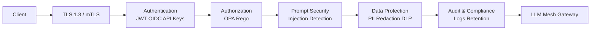
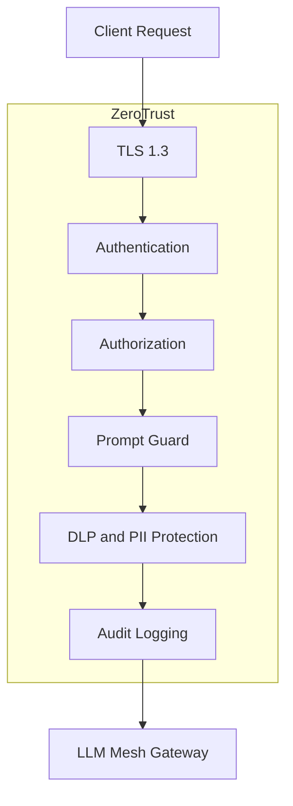

<p align="center">
  
  
  
  
  
  
</p>

<h1 align="center">LLM Mesh Gateway</h1>
<p align="center"><strong>Enterprise AI Gateway for Production-Grade Generative AI Systems</strong></p>
<p align="center">
  <a href="#architecture">Architecture</a> •
  <a href="#features">Features</a> •
  <a href="#security">Security</a> •
  <a href="#observability">Observability</a> •
  <a href="#deployment">Deployment</a> •
  <a href="#roadmap">Roadmap</a>
</p>

---


## 🎯 Executive Summary

**LLM Mesh Gateway** is a cloud-native AI gateway platform that provides **resilience**, **observability**, **governance**, and **security** for Generative AI applications at enterprise scale. Built on Envoy Proxy and designed for Kubernetes, it enables organizations to deploy multi-LLM architectures with production-grade reliability.

> **Problem**: Enterprises struggle with LLM vendor lock-in, unpredictable latency, prompt injection attacks, and lack of visibility into AI traffic.  
> **Solution**: A unified control plane that routes, protects, and observes every LLM interaction across your infrastructure.

---
##  Architecture projeto



## 🔒 Security Architecture



### 🔄 Resilience & Reliability
| Feature | Description | Technology |
|---------|-------------|------------|
| **Intelligent Routing** | Route by model capability, cost, or latency | Envoy xDS |
| **Automatic Fallback** | Seamless failover between LLM providers | Custom Lua/WASM |
| **Canary Releases** | Gradual rollout of new models | Envoy weighted clusters |
| **Circuit Breaker** | Prevent cascade failures | Envoy outlier detection |
| **Adaptive Routing** | Latency-based provider selection | Custom metrics |

### 🔐 Security & Governance
| Feature | Description | Technology |
|---------|-------------|------------|
| **JWT Authentication** | Token-based access control | Envoy JWT filter |
| **OPA Policy Engine** | Fine-grained authorization | Open Policy Agent |
| **Prompt Injection Detection** | Real-time prompt sanitization | Custom Python middleware |
| **Tool Abuse Detection** | Monitor excessive function calls | Risk scoring engine |
| **Data Exfiltration Prevention** | Block PII leakage | Regex + ML classifiers |
| **Rate Limiting** | Token-bucket per tenant | Envoy local rate limit |

### 📊 Observability & Analytics
| Feature | Description | Technology |
|---------|-------------|------------|
| **Distributed Tracing** | End-to-end request flow | OpenTelemetry |
| **Real-time Metrics** | Latency, cost, token usage | Prometheus + Grafana |
| **LLM Interaction Logging** | Prompt/response audit trail | Phoenix (Arize) |
| **Risk Scoring** | Anomaly detection per request | Custom scoring engine |
| **Cost Attribution** | Per-tenant, per-model billing | Custom metrics |

## ✨ Features

- JWT Authentication
- OPA / Rego Policy Enforcement
- Prompt Injection Detection
- Data Exfiltration Detection
- Tool Abuse Detection
- Circuit Breaker
- Automatic Provider Fallback
- Canary Releases
- Distributed Tracing
- Arize Phoenix Integration
- Grafana Dashboards
- Prometheus Metrics
- OpenTofu Infrastructure
- Kubernetes Ready


🔐 Camada de Segurança
Autenticação
JWT Validation
Claims Validation
Role Based Access Control
Políticas
OPA (Open Policy Agent)
Rego Policies
Runtime Enforcement
Detecção de Ameaças
Prompt Injection
Jailbreak Attempts
Tool Abuse
Data Exfiltration
PII Detection
AI Security Gateway
Score de risco
Correlação de eventos
Decisão automática
Exportação para SIEM

🔄 Resiliência
Circuit Breaker
Proteção contra provedores indisponíveis.
Fallback Automático
 Grok →  Lhama Modelo Local
Canary Releases
Distribuição progressiva de tráfego entre versões de modelos.
Rate Limiting
Proteção contra abuso e picos de utilização.

📊 Observabilidade
Prometheus
Coleta de métricas operacionais:
Requests por segundo
Latência
Erros
Utilização de provedores
Score de risco
Grafana

Dashboards para:

Tráfego
Segurança
Resiliência
Custos
Performance
OpenTelemetry
Tracing distribuído ponta a ponta.
Arize Phoenix

Monitoramento de:
Traces
Latência
Fluxo de requisições
Qualidade operacional
☁️ Infraestrutura como Código

Toda a infraestrutura é provisionada utilizando OpenTofu.

Recursos provisionados
Namespace Kubernetes
Gateway
Prometheus
Grafana
ConfigMaps
Services
Deployments

---

## 🚀 Quick Start

### Prerequisites
- Kubernetes 1.28+
- Helm 3.12+
- OpenTofu 1.6+
- Python 3.11+

### 1. Infrastructure Provisioning

```bash
# Clone repository
git clone https://github.com/sereno4/llm-mesh-gateway.git
cd llm-mesh-gateway

# Provision infrastructure
cd infrastructure/environments/dev
tofu init
tofu plan
tofu apply
2. Deploy Gateway
bash
# Install via Helm
helm repo add llm-mesh https://sereno4.github.io/llm-mesh-gateway
helm install gateway llm-mesh/llm-mesh-gateway \
  --namespace llm-mesh \
  --create-namespace \
  --values values.yaml
3. Configure Providers
yaml
# config/providers.yaml
providers:
  openai:
    api_key: ${OPENAI_API_KEY}
    models: ["gpt-4", "gpt-3.5-turbo"]
    priority: 1
    timeout_ms: 30000
  
  anthropic:
    api_key: ${ANTHROPIC_API_KEY}
    models: ["claude-3-opus", "claude-3-sonnet"]
    priority: 2
    fallback: true
  
  local:
    endpoint: "http://llama-3-70b.local:8000"
    models: ["llama-3-70b"]
    priority: 3
    on_prem: true
4. Send First Request
bash
curl -X POST https://gateway.your-domain.com/v1/chat/completions \
  -H "Authorization: Bearer ${JWT_TOKEN}" \
  -H "Content-Type: application/json" \
  -d '{
    "model": "gpt-4",
    "messages": [{"role": "user", "content": "Hello, world!"}],
    "routing_hint": "low_latency"
  }'

```
Risk Scoring Engine
Python
# Example risk scoring
def calculate_risk_score(request: LLMRequest) -> RiskAssessment:
    score = 0.0
    
    # Prompt injection patterns
    if contains_jailbreak_patterns(request.prompt):
        score += 0.4
    
    # Data exfiltration attempt
    if requests_sensitive_data(request.prompt):
        score += 0.3
    
    # Tool abuse
    if tool_call_frequency > threshold:
        score += 0.2
    
    # Token exhaustion attack
    if request.max_tokens > 10_000:
        score += 0.1
    
    return RiskAssessment(
        score=score,
        threshold=0.5,
        action=Action.BLOCK if score > 0.5 else Action.LOG
    )
📈 Observability Stack
Metrics (Prometheus)
promql
# LLM request latency by provider
histogram_quantile(0.95, 
  rate(llm_request_duration_seconds_bucket[5m])
)

# Token consumption per tenant
sum by (tenant) (llm_tokens_total)

# Cost per model per hour
sum by (model) (llm_cost_usd)
Dashboards (Grafana)
Executive Overview: Cost, usage, SLA compliance
SRE Operations: Latency, errors, circuit breaker status
Security Operations: Blocked requests, risk scores, anomalies
FinOps: Cost per tenant, model efficiency, budget alerts
Tracing (OpenTelemetry)
JSON
{
  "trace_id": "4f9e2e...",
  "spans": [
    {"name": "jwt_validation", "duration_ms": 2},
    {"name": "opa_policy_check", "duration_ms": 5},
    {"name": "prompt_guard", "duration_ms": 15},
    {"name": "openai_request", "duration_ms": 1200},
    {"name": "response_filter", "duration_ms": 3}
  ]
}
🏢 Enterprise Use Cases
Table
Industry	Use Case	Gateway Features
Finance	Trading copilots with PII protection	Data exfiltration detection, OPA policies
Healthcare	Clinical decision support	HIPAA compliance, audit trails, on-prem routing
Legal	Contract analysis across jurisdictions	Geo-routing, data residency, retention policies
SaaS	Multi-tenant AI platform	Per-tenant rate limits, cost attribution, RBAC
Government	Secure classified analysis	Air-gapped deployment, custom models only
🗺️ Roadmap
Q3 2026
[ ] Multi-provider failover with health checks
[ ] Circuit breaker with adaptive thresholds
[ ] Cost tracking and AI FinOps dashboard
[ ] Runtime security analytics
Q4 2026
[ ] Governance dashboard with policy editor
[ ] Model performance benchmarking suite
[ ] Fine-tuning pipeline integration
[ ] SOC 2 compliance documentation
2027
[ ] Federated learning gateway
[ ] Edge deployment (K3s, IoT)
[ ] Auto-scaling based on queue depth
[ ] Multi-region active-active
🤝 Contributing
We welcome contributions from the AI infrastructure community. Please see CONTRIBUTING.md for guidelines.
📄 License
MIT License - see LICENSE for details.
🙏 Acknowledgments
Envoy Proxy community for the extensible data plane
OpenTofu team for infrastructure-as-code tooling
Arize AI for LLM observability foundations
<p align="center">
  <strong>Built with ❤️ by <a href="https://github.com/sereno4">@sereno4</a></strong>
```
O ponto forte doprojeto não é apenas “um gateway para LLM”. O diferencial é a combinação de:

Segurança para IA
Resiliência (fallback + circuit breaker)
Observabilidade (Grafana + Phoenix)
Governança (OPA/Rego)
Infraestrutura como código (OpenTofu)

Próximos Passos
Integração com múltiplos provedores comerciais
FinOps para consumo de LLMs
Avaliação automática de respostas
Monitoramento de drift
Detecção avançada de comportamento anômalo
Governance Layer para IA Generativa


<p align="center">
  
  
  
  
</p>


